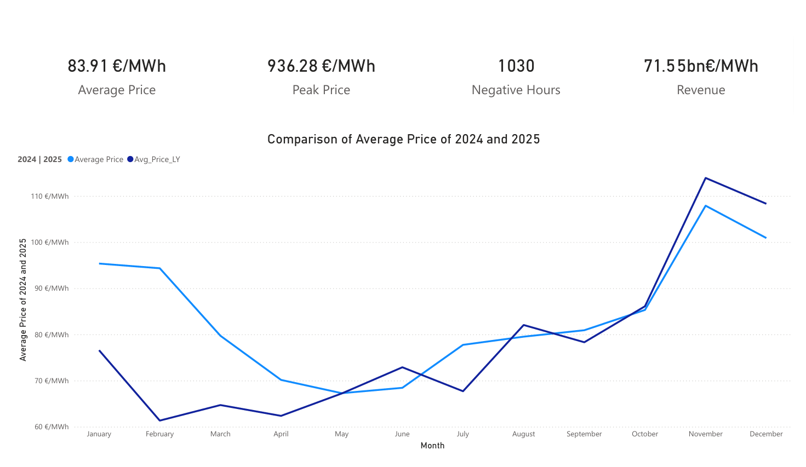
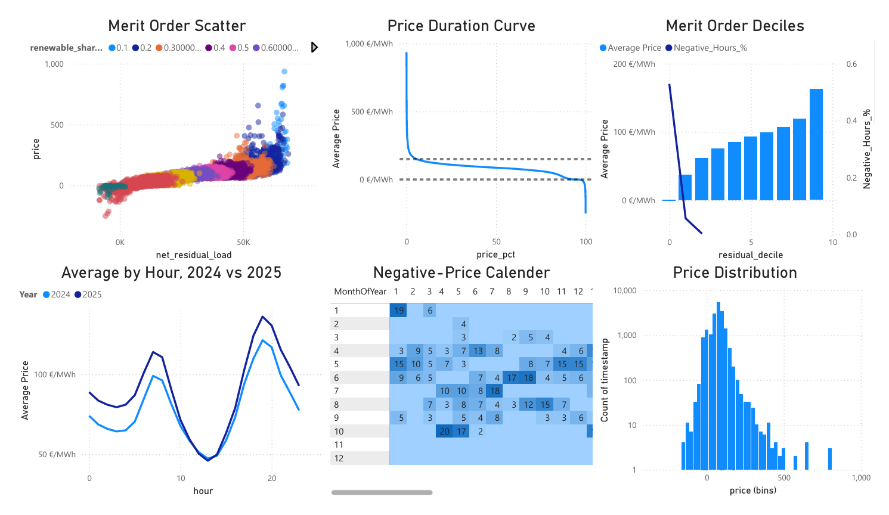
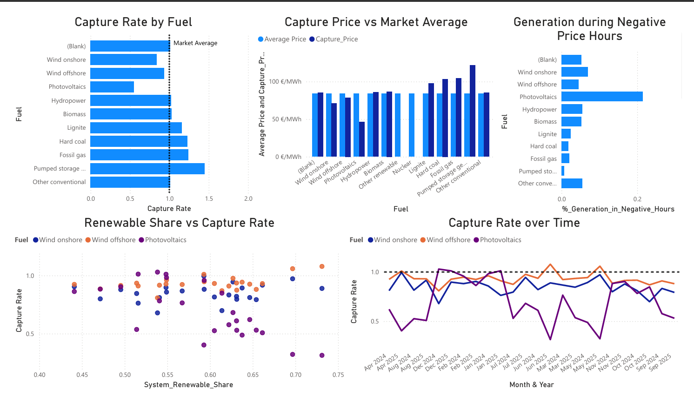
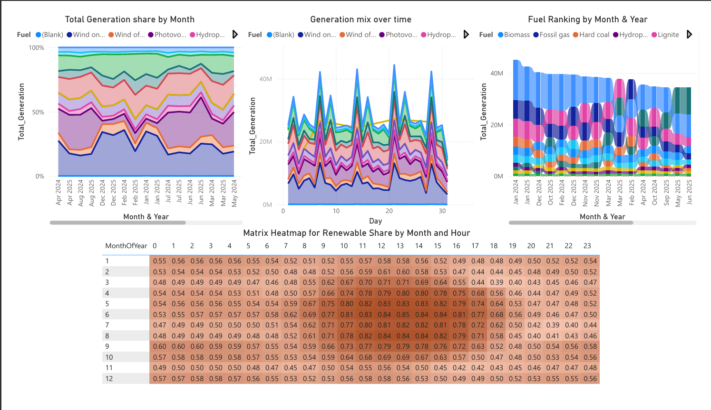

# German Electricity Market Analysis (SMARD)

**What sets the price of electricity in Germany, and what does that cost the
people generating it?**

An end-to-end analysis of 17,544 hours of German electricity market data:
cleaning, exploratory analysis, visualization, machine learning, and an
interactive Power BI dashboard.



---

## Tech stack

**Analysis**

| Tool | Use |
|---|---|
| Python 3.13 | pipeline language |
| pandas, numpy | data handling, merging, feature engineering |
| scikit-learn 1.8 | `HistGradientBoosting`, Ridge, permutation importance, partial dependence |
| matplotlib, seaborn | static charts, heatmaps |
| plotly | interactive scatter and area charts |
| holidays | German public-holiday calendar |
| JupyterLab | notebook orchestration |

**Dashboard**

| Tool | Use |
|---|---|
| Power BI Desktop | report and data model |
| Power Query (M) | unpivoting, date dimension, type handling |
| DAX | capture rates, deciles, time intelligence |

**Other:** Git, VS Code, Windows.

> `shap` is listed in `requirements.txt` but is unavailable in this environment:
> importing it pulls in numba, whose compiled extension is blocked by a Windows
> Application Control policy. Attribution uses `sklearn.inspection` instead,
> which measures importance on the test set and is arguably the more honest
> choice across a regime shift.

---

## The data

[SMARD](https://www.smard.de) (*Strommarktdaten*) is the official electricity
market data platform of the **Bundesnetzagentur**, Germany's Federal Network
Agency. It publishes the data that grid operators are legally required to report.

Three hourly exports, 1 January 2024 to 31 December 2025:

| File | Contents |
|---|---|
| `Actual_generation` | Generation by 12 fuel types (wind on/offshore, solar, biomass, hydro, nuclear, lignite, hard coal, gas, pumped storage, other) |
| `Actual_consumption` | Grid load, load including pumped storage, residual load |
| `Day-ahead_prices` | Day-ahead clearing prices for Germany/Luxembourg and 16 neighbouring bidding zones |

17,544 hours after merging. Only 2 hours are genuinely missing from the series.

### Why 2024 and 2025

Germany shut down its last three nuclear reactors on **15 April 2023**. This
period is therefore the **first clean two-year window of a fully post-nuclear
German power system** , no residual nuclear baseload distorting the merit order,
and no transitional period to control for.

The data confirms it: the `Nuclear` column is 0.00 MWh until SMARD stops
reporting it entirely on 30 January 2024, and null thereafter. With nuclear gone,
**lignite** sits at the bottom of the dispatch stack, which is visible in its
0.657 correlation with price.

The window also captures a genuine regime shift. Prices rose roughly 14% between
the two years while renewable penetration continued climbing, which makes it a
useful test of whether a model trained on one year generalises to the next. It
does not, entirely, and that turned out to be one of the more interesting results.

---

## Dashboard

<table>
<tr>
<td width="50%"></td>
<td width="50%"></td>
</tr>
<tr>
<td><em>Market overview. Mean price rose from 78.51 to 89.33 EUR/MWh between
2024 and 2025, across 1,030 negative-price hours.</em></td>
<td><em>Price analysis. Mean price rises monotonically across all ten
residual-load deciles, from -0.77 to 162.43 EUR/MWh.</em></td>
</tr>
<tr>
<td width="50%"></td>
<td width="50%"></td>
</tr>
<tr>
<td><em>Capture rates. Wind and solar earn below the market average, quantifying
cannibalisation in euros per MWh.</em></td>
<td><em>Generation mix. Renewable share by fuel over two years, with the
seasonal handover between wind and solar.</em></td>
</tr>
</table>

---

## Pipeline

**1. Clean** &nbsp;·&nbsp; `src/data_loader.py`, `src/features.py`

- Parse three CSVs: `;` separated, English-locale numbers (`3,920.75`), `-` for missing
- Merge on an hourly timestamp index, deduplicate the repeated October DST hour
- Reindex onto a complete hourly spine
- Engineer 17 features: renewable and conventional totals, renewable and VRE
  shares, net residual load, calendar features, German public holidays, lagged
  prices and load
- **Output:** `data/processed/clean_hourly.csv`, the single input to every later stage

**2. Explore** &nbsp;·&nbsp; `src/eda.py`

- Null profiling *before* any filtering, with first- and last-valid timestamps
  per column
- Automatic screening of dead columns on null rate and cardinality
- Pairwise Pearson, Spearman, and mutual information against price
- Correlation stability split by year
- Multicollinearity detection: 24 predictor pairs exceed |r| 0.8
- Merit-order decile analysis

**3. Visualize** &nbsp;·&nbsp; `src/visualize.py`

- Fuel mix stacked area, price duration curve, merit-order scatter coloured by
  renewable share, renewable-share heatmap by hour and month, negative-price
  calendar, price distribution on a log scale

**4. Interpret**

Written by hand after reviewing the charts, deliberately in that order.

**5. Model** &nbsp;·&nbsp; `src/models.py`, `src/evaluate.py`

- Chronological split: train 2024, test 2025, never shuffled
- Hyperparameters selected on a validation split *within* 2024
  (Jan-Sep train, Oct-Dec validate); 2025 used exactly once, for final evaluation
- Primary model: binary classifier for negative-price hours
- Secondary: gradient-boosting regression on actual generation, framed as
  attribution rather than forecasting
- Permutation importance and partial dependence for feature attribution

**6. Dashboard** &nbsp;·&nbsp; Power BI

- Star schema built in Power Query: hourly market table, unpivoted generation
  table, fuel-type dimension, date dimension
- DAX measures for capture rates, cannibalisation, merit-order deciles, and
  negative-price concentration

---

## Repository

```
data/raw/          the three SMARD exports (committed)
data/processed/    clean_hourly.csv (generated, not committed)

src/
  config.py          paths, column groups, constants, plot theme
  data_loader.py     parsing, merging, DST handling, null profiling
  features.py        engineered columns, lags, calendar
  eda.py             profiling and correlation functions
  visualize.py       chart builders
  models.py          classifier and attribution models
  evaluate.py        metrics, regime splits, baselines

notebooks/
  SMARD_analysis.ipynb          clean, explore, visualize, interpret
  SMARD_machine_Learning.ipynb  modelling

PowerBI/           dashboard screenshots
```

Every function in `src/` is pure: it takes arguments and returns a value. No
printing, no plotting side effects, no file writes. The notebooks call them,
display the results, and hold all written interpretation.

### Running it

```powershell
python -m venv .SMARD
.SMARD\Scripts\Activate.ps1
pip install -r requirements.txt
python -m ipykernel install --user --name smard --display-name "SMARD"
jupyter lab
```

Run `notebooks/SMARD_analysis.ipynb` first. Its Clean section generates
`data/processed/clean_hourly.csv`, which every other notebook and the Power BI
report read. Then run `notebooks/SMARD_machine_Learning.ipynb`.

---

## Modelling

Train 2024, test 2025, chronological split.

| Model | Features | MAE | R² | Notes |
|---|---|---|---|---|
| Naive `price_lag24` | yesterday, same hour | 25.97 | 0.397 | baseline |
| **GBM (forecast)** | **lags + calendar** | **23.70** | **0.540** | **beats baseline** |
| GBM (attribution) | actual generation | 15.39 | 0.789 | explanatory, not a forecast |
| Ridge (attribution) | actual generation | 16.92 | 0.772 | explanatory, not a forecast |

**Negative-price classifier** (primary model), selected on PR-AUC rather than
accuracy given a 6.5% base rate: **average precision 0.784**, ROC-AUC 0.981,
precision 0.625 and recall 0.813 at the default threshold.

### On calling things forecasts

The dataset contains **actual** generation, not day-ahead **forecasts**. A model
using actual wind and solar output to predict the same hour's price is not
forecasting anything: at real prediction time those values are unknown.

Models here are labelled accordingly. Only the lags-and-calendar model is
described as a forecast, and it is the one reported against the naive baseline.
The generation-based models are labelled attribution throughout, in code,
docstrings, and notebook text.

### A feature that passed validation and failed reality

`month` looked like a useful predictor. Adding it to the attribution model
**improved** same-year validation MAE from 19.52 to 18.95 on an October to
December 2024 holdout.

On the 2025 test set it **degraded** MAE by 4.09, from 15.39 to 19.48.

The cause is visible in the correlation table: `month` correlates +0.249 with
price in 2024 and -0.101 in 2025. The sign flips. A model that learned 2024's
seasonal pattern applied it backwards to 2025.

Validation on data from the same period as training will not catch this. It is
excluded from every model in this project, and the rule is documented so it
cannot quietly reappear.

---

## Key findings

**Residual load sets the price.** Mean price rises monotonically across all ten
residual-load deciles, from **-0.77** to **162.43 EUR/MWh**. This is the
merit-order curve recovered directly from market data: the last unit dispatched
sets the clearing price for everyone.

**Negative prices are structural, not freak events.** 1,030 hours, **5.9%** of
the period, cleared below zero. In the lowest residual-load decile, **52.9%** of
hours were negative. The floor of the series is **-250.32 EUR/MWh**.

**Renewables cannibalise their own revenue.** Renewable share correlates
**-0.752** with price. Wind and solar generate hardest at the same hours as each
other, pushing the clearing price down precisely when they have most to sell, so
they earn systematically less per MWh than the market average of **83.91**.

**Solar's effect is invisible to a naive correlation.** Photovoltaics shows
Pearson **-0.474** but Spearman **-0.227**, a non-monotonic relationship created
by the mass of night-time zeros. Its price effect cannot be read without
conditioning on hour of day.

**The market moved between years.** Mean price rose from **78.51** in 2024 to
**89.33** in 2025, and feature correlations strengthened alongside it. Any model
trained on one year and applied to the next carries that shift as error.

**A forecast-legal model beats persistence.** Using only information available
before the day-ahead auction closes, gradient boosting reached **MAE 23.70**
against a naive baseline of **25.97**, an 8.7% improvement.

---

*Data: [SMARD](https://www.smard.de), Bundesnetzagentur. Analysis and dashboard
by Nevitha.*
